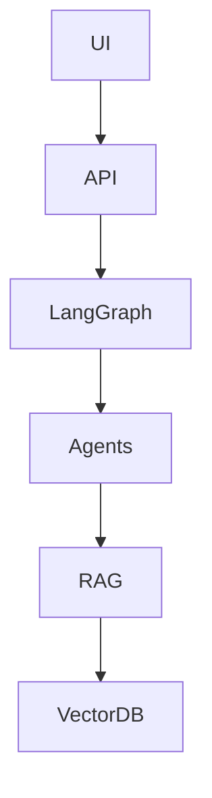

# AI Media Buyer Orchestration Layer

## Overview
This is a production-ready GenAI + RAG + LangGraph project.  
It includes:
- Full LangGraph Orchestration
- RAG Pipeline (Chunking, Embedding, Retrieval)
- FastAPI Microservice
- Docker Deployment
- Multi-Agent LLM Workflows

## Architecture


## Installation
```
pip install -r requirements.txt
uvicorn src.api.server:app --reload
```

## Run with Docker
```
docker build -t ai_media_buyer .
docker run -p 8080:8080 ai_media_buyer
```

## Folder Structure
```
src/
  api/
  agents/
  rag/
  workflows/
```

## Orchestration
LangGraph is used to manage multi-agent workflows, error handling and memory.

## RAG
Includes:
- Chunker
- Embedder (Sentence Transformers)
- Retriever (ChromaDB)
